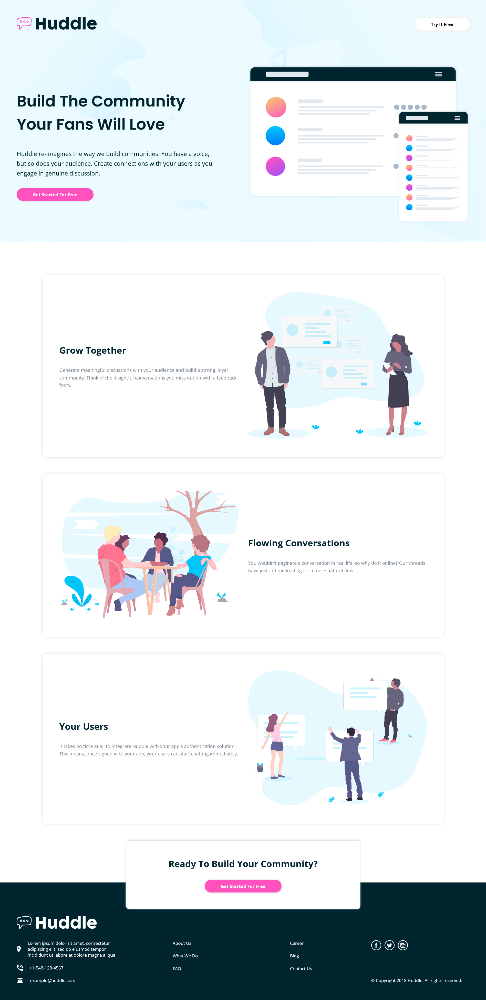
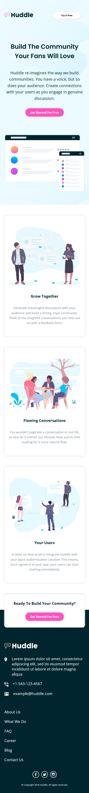

# Frontend Mentor - Huddle landing page with alternating feature blocks solution

This is a solution to the [Huddle landing page with alternating feature blocks challenge on Frontend Mentor](https://www.frontendmentor.io/challenges/huddle-landing-page-with-alternating-feature-blocks-5ca5f5981e82137ec91a5100). Frontend Mentor challenges help you improve your coding skills by building realistic projects. 

## Table of contents

- [Overview](#overview)
  - [The challenge](#the-challenge)
  - [Screenshot](#screenshot)
  - [Links](#links)
- [My process](#my-process)
  - [Built with](#built-with)
  - [What I learned](#what-i-learned)
  - [Continued development](#continued-development)
  - [Useful resources](#useful-resources)
- [Author](#author)


## Overview
  This is a responsive landing page challenge by frontendmentor.
  The design is four sections nav-bar, hero-section, main page consisting of three cards of Z-pattern and finally the footer.
### The challenge

Users should be able to:

- View the optimal layout for the site depending on their device's screen size
- See hover states for all interactive elements on the page

### Screenshot
#### Disk Top Version


#### Mobile Version



### Links

- Live Site URL: [Click Here](https://ibrahim-eltoukhy.github.io/hlp/)

## My process

### Built with

- Semantic HTML5 markup
- CSS custom properties
- Flexbox
- CSS Grid
- Mobile-first workflow


### What I learned

In this challenge I have learned to make my page responsive using media query and css grid, make my css file more organized and by using variables  


```css
:root {
  /* COLORS */
  --color-primary: #ff52bf;
  --color-sec-dark: #00252e;
  --color-sec-light: #808d99;

  /* Spaces */

  --section-margin: 100px;
  --section-padding: 50px;
}
```


### Continued development

The mobile first approach will be taken into account in the future projects also using css library like bootstrap also will be considered. 

### Useful resources

- [MDN](https://developer.mozilla.org/en-US/) - This is the best documentation for web development online which helped me a lot in learning HTML and CSS.
- [W3SCHOOLS](https://www.w3schools.com/) - This is also a good recourse that helped me a lot in my learning journey.


## Author

- Linkedin - [Ibrahim Eltoukhy](https://www.linkedin.com/in/ibrahim-el-tokhy/)
- Frontend Mentor - [@Ibrahim-Eltoukhy](https://www.frontendmentor.io/profile/Ibrahim-Eltoukhy)
